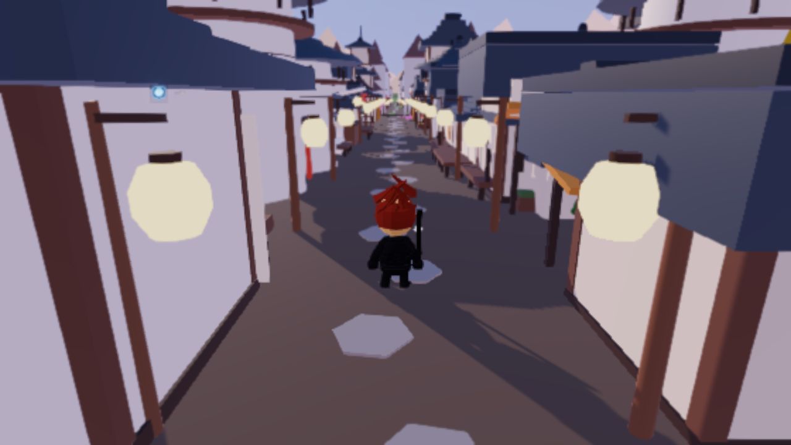
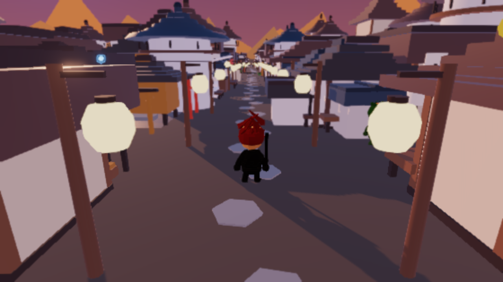
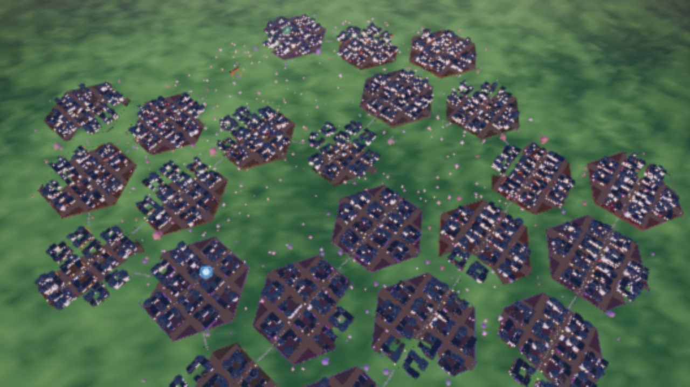
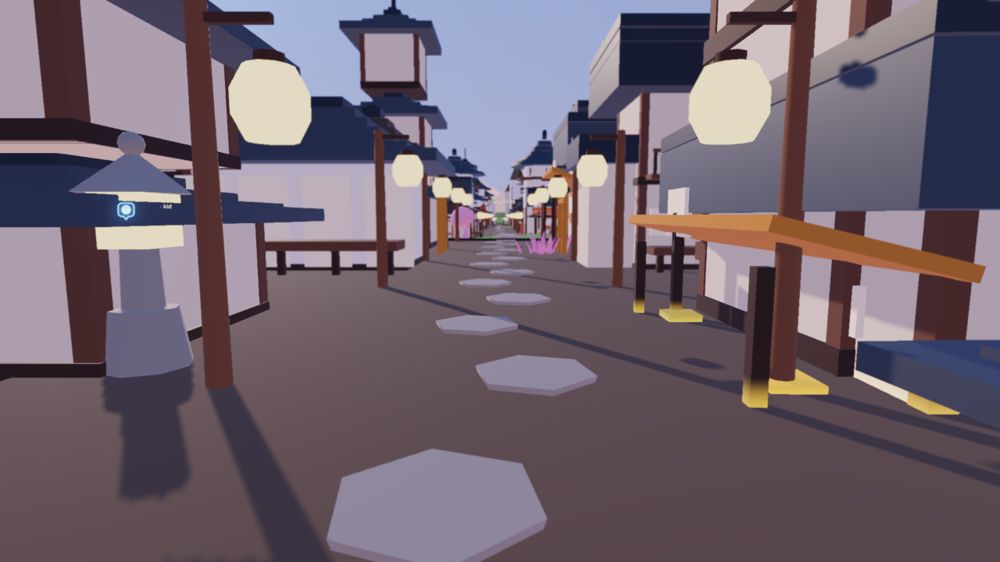
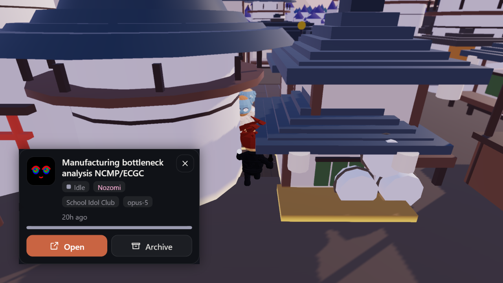

<div align="center">

# Anime Crossing

### Every coding-agent thread on this machine is an anime character — and you can walk among them.

[](LICENSE)
[](https://github.com/jarrenrocks/bot-crossing)
[](#it-stays-on-your-machine)

<br>



</div>

<br>

Each thread is dealt a cast of its own — a pirate crew, the wall scouts, a soul reaper
division, a demon slayer corps, twenty-four in all — which decides its hair, its eyes, its
outfit, its name and what it says to you. The same chat is the same character every time you
open the page.

Every repo is a **city** — real streets, real blocks, a resident on every one of its threads —
joined to the others by roads across open country. The world itself is a shrine hillside under
blossom, a neon sprawl, or a spirit realm at teal dusk, six of them, changed with `G`.

Walk up to someone with `WASD`, press `E`, and they will say something before their thread
card opens with **Open** and **Archive** on it. `Tab` steps back to the overhead map.

<br>

<table>
<tr>
<td width="50%"><br><sub align="center">A different world, a different sky — six in all, changed with <code>G</code></sub></td>
<td width="50%"><br><sub align="center">Every repo really is a city — <code>Tab</code> steps back to see all of them at once</sub></td>
</tr>
</table>

<br>

### It stays on your machine

It reads the harness's own files, on your own machine. Nothing is uploaded, there is no
account, and the only thing it ever writes back is a single archive flag.

> **This is a fork** of [Bot Crossing](https://github.com/jarrenrocks/bot-crossing) by Jarren
> Rocks, which is the same idea as a space colony you look down on. Everything underneath —
> the harness adapters, the instanced crowd, the camera, the layout rule — is theirs. What
> changed here is the cast, the cities, and the fact that you are standing in it. See
> [CONCEPT.md](CONCEPT.md) for what was actually rebuilt and why.
>
> Characters are original designs in an anime *style*. Nothing here reproduces a character
> from any particular show.

<details>
<summary><strong>Contents</strong></summary>

- [Run it](#run-it) · [Controls](#controls)
- [Which harnesses work](#which-harnesses-work)
- [What you are looking at](#what-you-are-looking-at)
- [Getting about](#getting-about) — how the crew walks and paths
- [Clicking one](#clicking-one) — opening and archiving threads
- [Getting around](#getting-around) — the map camera
- [Keys](#keys)
- [Worlds and light](#worlds-and-light)
- [Where the art comes from](#where-the-art-comes-from)
- [Animating the crew](#animating-the-crew)
- [Performance](#performance)
- [The faces](#the-faces)
- [Keeping it local](#keeping-it-local)
- [Building your own](#building-your-own)
- [Who made this](#who-made-this) · [Licence](#licence)

</details>

## Run it

```bash
npm install && npm run dev
```

`npm run dev` is the whole thing: the API lives inside the Vite dev server, so there is no
second process.

### Controls

| | |
| --- | --- |
| `W` `A` `S` `D` | Walk |
| `Shift` + those | Run |
| `E` | Talk to whoever is closest — or open the building you are standing at, or play at the festival stall |
| `1` `2` `3` | Reply, while a conversation is open |
| `R` | Summon something to ride |
| `V` | First person / third person |
| `Tab` | Swap between walking and the overhead map |
| drag | Turn the camera (walking) or drag the ground (map) |
| click a repo or thread | Walk there (in walk mode) or fly there (on the map) |
| `\\` | Collapse the side panel |
| `M` | Mute the sound |
| `G` | Change world — six of them, each with its own architecture and weather |
| `?` | Everything else |

**Two things to play.** Every district has a **festival stall** on its cross street, a few
paces from the crossroads: press `E` at the counter for *kingyo-sukui*, where you scoop
goldfish with a paper net that dissolves as you use it. And any character who is **idle** will
take you on — talk to one and pick *Race you to the stall*. They run the real streets on the
real navigation grid, so they go round the blocks the same as you do, and they are quick
enough that walking loses. Hold `Shift`.

Neither reads or writes a thread. That is deliberate: everything else you can see means
something, so the games are kept somewhere the data never goes.


<sub align="center"><code>V</code> drops you into first person — the same street, the same crew, from eye height.</sub>

For a built version, `npm start` (build + serve) or `npm run serve` if
`dist/` already exists. Binds to `127.0.0.1` by default, and answers only its own page — see
[Keeping it local](#keeping-it-local).

**macOS, Linux and Windows.** Opening a thread, revealing a folder and starting a new session
all go through a `harness://` deep link handed to the OS opener — `open(1)` on macOS,
`xdg-open` on Linux, ShellExecute on Windows. The scanning half was portable already. Note that
the deep link needs a desktop app registered for that scheme, so on Linux the folder buttons
work while opening a thread has nothing to reach yet.

## Which harnesses work

A **harness** is whatever actually runs your threads. Bot Crossing reads each one's local
session files through a small adapter, so support is per-harness and mostly a matter of
somebody writing that adapter.

| Harness | Status |
| --- | --- |
| **[Claude Code](https://claude.com/claude-code)** (Anthropic) | ✅ **Supported** — desktop app and CLI, including worktrees, live-process detection and archiving |
| [Codex CLI](https://developers.openai.com/codex/cli) (OpenAI) | ⬜ Not yet — transcripts found at `~/.codex/sessions/`, [notes here](server/harnesses/README.md#starting-points) |
| [OpenCode](https://opencode.ai) | ⬜ Not yet |
| [Antigravity CLI](https://antigravity.google) (Google) | ⬜ Not yet — the successor to Gemini CLI, which Google stopped serving individual accounts on 18 June 2026 |
| [Cursor](https://cursor.com) (`cursor-agent`) | ⬜ Not yet |
| [Amp](https://ampcode.com) (Sourcegraph) | ⬜ Not yet |
| [Aider](https://aider.chat) | ⬜ Not yet |
| [Goose](https://block.github.io/goose/) (Block) | ⬜ Not yet |
| [Qwen Code](https://github.com/QwenLM/qwen-code) (Alibaba) | ⬜ Not yet |
| [Amazon Q Developer CLI](https://aws.amazon.com/q/developer/) | ⬜ Not yet |

Every harness that is installed shows up at once — the colony is the union of all of them, and
a character carries the name of the harness it belongs to.

### Adding one

One new file in `server/harnesses/`, one line in its `index.mjs`, and nothing else. The
interface is small and written down in full, along with the thread shape, the ground rules,
and how to find where a given harness keeps its sessions:

**→ [`server/harnesses/README.md`](server/harnesses/README.md)**

If you add one, a PR is very welcome — see [CONTRIBUTING.md](CONTRIBUTING.md) first, which is
honest about how much support I can offer. If landing it means editing the scanner or anything
under `src/`, please mention that: it means the seam needs widening, and I would rather fix that
than have you work around it.

## What you are looking at

| In the world | In your threads |
| --- | --- |
| One city | One repo. Bigger repos claim more districts — one per sixteen threads, grown as a contiguous blob from the middle outward. A zone stays where it is: see below |
| One character + one building | One session |
| Which genre a character is | A hash of that session's id, so it never changes |
| The spirit orb at their shoulder | What that thread is doing right now |
| The badge over their head | That thread wants a reply from you |
| How finished a building looks | How large its transcript is, on a log scale |
| Scaffolding | Somebody is at that site right now |
| Walking out from under the gate | A thread that just appeared |
| Walking back through the gate | You archived it |

Status is carried by the orb and the badge, never by the character itself — the outfit says
*which chat* this is, and repainting it by status would throw that away.

### A zone stays where it is

The map is only useful if you can learn it, so the layout is *sticky*. The previous
arrangement is an input to the next one: a repo that still needs the same number of tiles
keeps exactly the tiles it had, one that grew keeps them and claims neighbours, and one that
shrank gives back whatever it claimed most recently — so growing and shrinking again returns
a zone to precisely the shape it started in. Only a repo that has never been placed is
placed at all, and it takes the innermost tiles still free.

A zone's origin is its **root** tile rather than the centre of the tiles it happens to hold,
so gaining one does not drag its buildings, its crew and its name sideways; the new tile
simply appears alongside. And the arrangement is written to `data/colony.json`, so the map
you have learned survives a reload — including for a repo whose last thread you archived,
which comes back to the same ground when you start a new one.

The version before this was a pure function of the thread counts: one session appearing
anywhere changed the sort order, the order decided the tiles, and the whole colony re-laid
itself out. A zone you were watching could jump to the far side of the map because a
*different* repo gained a thread.

### The deck has to clear the ground

Inside the colony the terrain is gentle but not flat, and it rolls further now that the
lattice spans real distance between cities. A deck's top face has to sit above the roughest
ground any plot can be dealt, or the ground comes through it: the slab reads as sunken, props
standing on it are buried to the waist, and every surface where the two meet tears. So the
slab is 0.45 tall, and everything on a plot — buildings, kerbs, clutter, boots — is measured
from that one number rather than from a height of its own.

Ground scatter has to miss the plots, and the order it happens in is the whole problem: the
world is built before the first roster arrives, so at that moment there are no plots to miss.
Boulders and trees would end up under decks laid on top of them afterwards, poking through in
fragments. The scatter is therefore rebuilt whenever a zone's footprint changes — cheap,
because it no longer drags the terrain mesh along with it.

Character behaviour is a **strict precedence** rather than a set of independent flags, so a
thread can only ever be doing one thing. First match wins:

| Signal | What the character does | Badge |
| --- | --- | --- |
| Errored | Slumps, aura flickers red | `!` |
| Running now | Works at its site, the spirit orb sparks | `⚒` |
| PR merged | Jumps, cheers | `✓` |
| Unread | **Stops and waits on you** | `?` |
| Nothing for 3 days | Sits down, `z` bubbles | — |
| Anything else | Potters around its plot | — |

Only the states that want something from you get a badge. With most of a real thread list
sitting quiet, a symbol over every character buries the one `?` that actually matters.

Zone names follow the same rule: a plot shows its name only while somebody there is working,
waiting or stuck. Everything else is nameless until you point at it. The plate itself is just
text over a soft halo with a small accent dot — no panel, no outline.

## Getting about

Characters route rather than drift. Every building, back-street terrace and piece of
clutter on a deck is rasterised into a navigation grid whenever the roster changes, and the
crew walks it with A*, string-pulled afterwards so they take the corners they actually need
instead of a visible staircase — over a grid that now covers real cities and the roads
between them, not one small platform.

Two guarantees, deliberately independent:

- **Routing** finds a way *around* a building, including threading the gaps between a row of
  them. Blocking radii are each building's footprint trimmed a little plus the character's
  own width — the trim is what keeps a street's gaps walkable.
- **Collision** is applied to every step whether or not a path is being followed. Routing can
  fail — a site walled in between polls, a path budget that has not caught up — and walking
  through a wall must not be what happens when it does. Blocked head-on, a character slides
  along the obstacle instead of stopping dead.

A new character no longer spawns at the world's gate and walks the length of the colony to
reach its own city — at city scale that walk could take longer than the crowd's own patience
for finding somewhere to stand, and used to end with everyone giving up in the same empty
field. It now appears a short way down its own street and settles from there, and how long an
arrival is allowed to take is worked out from the distance it actually has to cover rather
than one flat timeout for every walk in the colony.

They also push each other apart, so a busy street is a crowd rather than a pile — spaced
against the widest thing a character wears, so a crowd never reads as standing inside itself.
Arrival distance is deliberately a little larger again: a character that had to get closer
than its neighbours would let it could never finish arriving, and would shoulder at the crowd
for as long as its thread existed.

Standing spots are placed clear of a building's own blocked radius rather than at a fixed
distance from it, and checked against the navigation grid — a spot inside a wall is a spot the
crew can never reach, and the character sent to it walks at that wall forever. As a last
resort a character that has been blocked for several seconds adopts the ground it got to
instead of pushing on.

## Clicking one

All of the chrome is one panel on the right — the name, the counts, and every repo. There
is no top bar and no strip along the bottom: a colony is a place, and a place reads better
without a frame around it.

A character, a zone's deck, the name plate over it, or a repo in that list — all four drill
into the same repo. Picking somebody is also picking the zone they are standing on.


<sub align="center">The actual card, parked beside the actual character it belongs to — status, model, last activity, <strong>Open</strong> and <strong>Archive</strong>.</sub>

**The repo**, at the top, whether or not anybody is selected:

- **New conversation** (`C`) starts a fresh thread in that folder. It is the same
  `claude://code/new?folder=…` deep link Finder's "New Claude Code Session Here" quick
  action uses, so the desktop app opens an empty session with the repo as its workspace —
  nothing is resumed and nothing is written.
- **Finder** (Explorer on Windows) opens the folder, **Copy path** copies it.
- Underneath, everything running in that repo, whoever wants something first. Clicking one
  walks or flies to its character and selects it.

**The thread**, when a character is selected, in a card parked **beside that character**
rather than in the panel: its face, title, worktree, branch, model, last activity, and how
far along its building is. The answer to "what is this one doing" belongs next to the thing
you clicked, so the card follows its character around the screen — preferring its right,
flipping to its left rather than sliding under the sidebar, and never leaving the window.
It is moved with a transform rather than with `left`/`top`, the one geometric change a
browser makes without touching layout, so following a walking character costs nothing.

- **Open** hands the thread back to Claude Code and the desktop app comes forward.
- **Archive** sets `isArchived` on Claude Code's own session record — the thread lands in
  Claude Code's Archived list, not just here — and the character walks back through the gate.

Only one button in the panel is ever the accent colour: whichever action is the immediate
one. `Esc` steps outward a notch at a time — the thread first, then its zone.

Opening uses `claude://claude.ai/epitaxy/<local_…>`, which *navigates* the desktop app to a
thread it already has. `claude://resume` is the fallback for threads that only exist as a CLI
transcript: it *imports* the transcript, which creates a second untitled session and rewrites
the `.jsonl`, so it is only ever used when there is nothing to navigate to.

Archiving carries a deliberate one-writer discipline: the browser owns
`data/colony.json` and PUTs it whole, `/api/archive` only touches Claude Code's records. If
both wrote it, a save from a page holding older state would silently drop every archive made
since that page loaded. Claude Code also rewrites its session records from memory and can
stomp the flag, so the colony re-asserts it on every scan — an archive that gets stomped comes
back within one poll.

Nothing is ever written to your Claude Code data except that one `isArchived` field. The
folder buttons only ever hand a path to `open`.

The deep links above are the **Claude Code adapter's** business, not the colony's — another
harness plugs its own in, and a harness with no deep link simply greys the button out. See
[`server/harnesses/README.md`](server/harnesses/README.md).

Plots are keyed by the folder's *name*, which is all the colony needs to draw one, so the path
is read back off the threads standing there. Where a name is ambiguous — `~/workspaces/1/foo`
and `~/workspaces/2/foo`, which is what you get keeping parallel copies instead of worktrees —
it grows leftward until it is not, and you get `1/foo` and `2/foo` on separate ground. Only
names that actually collide change, because the name is also the key your saved layout is
stored under and disambiguating everything would move every plot on the map. A repo that has
moved or gone since the last scan fails at the server rather than handing `open` a dead path.

Name plates are hit-tested in screen space rather than raycast: they are billboarded in the
vertex shader, so a raycast would test the quad where it was authored rather than where it
ended up. That test deliberately ignores whether the plate is currently faded in — pointing
at where a quiet project's name *would* be is exactly what makes it appear.

## Getting around

Navigation is Google Earth's, including both of the things that make Earth feel like Earth:

| | |
| --- | --- |
| **Drag** | Grabs the ground. The point under your cursor stays pinned there for the whole drag |
| **Right-drag** (or ⌃ / ⇧ / middle-drag) | Tilt and rotate. Up tilts toward the horizon |
| **Scroll** | Zooms **at the cursor**, not at the screen centre |
| **Two fingers** | Pinch to zoom, drag to pan — both anchored between your fingers |
| **Arrows**, **+** / **−** | Move and zoom from the keyboard |
| **Orbit mode** (rail button, or `O`) | Earth's auto-rotate: a slow sweep around whatever is centred, about two minutes a revolution. It drives the heading only, so you can keep dragging, tilting and zooming while it runs |

Both anchors are exact, not approximate: a 200px drag holds its grabbed point to 0.00 world
units, and dollying 62→37 holds the cursor's point to 0.01.

Optionally, letting go can ease the *angle* back to the nearest clean isometric heading after
a couple of seconds. Your position and zoom are never touched — going home on its own would
fight you; tidying the angle after you stop does not. It is off by default, because a camera
that moves when you did not ask it to is startling the first time you meet it. Turn it on
under **View → Return to isometric**.

## Keys

| Key | Does |
| --- | --- |
| `H` / `⌘\` | **Hide every panel.** The colony still reads: status lives above the crew's heads |
| `S` | Settings |
| `N` | Fly to the next character waiting on you |
| `Enter` / `A` | Open / archive the selected thread |
| `C` | New conversation in the open zone's folder |
| `O` | Orbit mode (map view) |
| `L` | Next time of day |
| `P` | Screenshot |
| `0` | Reset the view |
| `Esc` | Deselect, and close the zone sidebar |
| `?` | Help |

## Worlds and light

Six worlds — **Hanami Hills**, **Neo-Akihabara**, **The Spirit Realm**, **Summer Festival**,
**Skyward Isles**, **The Winter Arc** — each with its own architecture, weather and palette,
and a full day/night cycle you can scrub or let run. A world is a bag of colours, a weather
recipe and two switches; terrain, scatter, sky and lighting all read from the same preset, so
a seventh world is a data change rather than a code change.

<details>
<summary><strong>How the light actually works</strong></summary>

**The sky is the HDRI.** Rather than shipping an HDR environment map, the sky shader **is**
the environment map. A second copy of the sky dome — sharing the same uniforms, so it is
always the sky you are actually standing under — is rendered into a prefiltered radiance map
with `PMREMGenerator` and bound as `scene.environment`. That is what gives metal something to
reflect and dielectrics a directional ambient, and it is why the colony changes *character*
through the day rather than just changing brightness: at dusk over the festival stalls the
paper and timber pick up the sky's colour, in the spirit realm's teal dusk they stay cool and
desaturated. It regenerates only when the sky has actually moved, and never more than a few
times a second — measured cost **0.16 ms/frame**, off on Potato and Low.

**The sun is not overhead.** The solar arc is tilted, so noon puts the sun 54° above the
horizon and off to one side rather than at the zenith. That is load-bearing rather than
decorative: a sun directly overhead puts `N·L` at zero on every vertical wall in the colony,
and they go black with only ambient to catch.

**HDR and bloom.** Eye colours, lamps, windows and kerbs are all authored above 1.0 so the
bloom pass picks them out. The threshold is deliberately high (0.92) — only those things clear
it, so lit surfaces stay crisp instead of going hazy.

</details>

## Where the art comes from

The colony is built out of two CC0 asset packs by **[Kay Lousberg](https://kaylousberg.com)**,
plus the project's own shaders on top of them.

| Pack | Used for | Licence |
| --- | --- | --- |
| [KayKit : Space Base Bits](https://kaylousberg.itch.io/space-base-bits) | Structural pieces built into the procedural buildings (turbines among them), plus the crates and drums stacked around each plot | CC0 |
| [KayKit : Character Animations](https://kaylousberg.itch.io/kaykit-character-animations) | The crew's body — `Mannequin_Medium` — and all fifteen animation clips they play; the anime hair, props and faces are this fork's own, built on top of it | CC0 |
| [KayKit : Forest Nature Pack](https://kaylousberg.itch.io/kaykit-forest) | The trees, bushes and grass ringing every city, and the boulders scattered across every world | CC0 |

CC0 asks for nothing, but crediting Kay costs nothing either. If you rebuild the assets, both
packs go in `assets-src/` (see below).

What made Space Base Bits worth building on in the first place: it is **modular**, and all
forty-four models share **one 1024px gradient atlas** — which is why a building assembled
from several of its pieces still merges to a single geometry and a single draw call, exactly
as this fork's own Japanese-village generator does for the buildings it draws from scratch.

That atlas is an 8×4 grid of swatches, which turns out to be a useful thing to have. A *cell
index* is a stable name for a material, so the building shader can:

- **repaint one swatch into the repo's accent.** Kay's gold trim band is cell 11; the fragment
  stage swaps its hue while keeping the swatch's own light-to-dark gradient, so every plot's
  buildings wear that plot's colour with no extra material and no extra draw.
- **light that same swatch after dark**, which is what makes the window strips come on at night.
- **give one flat texture real PBR.** Roughness and metalness are looked up per cell, so the
  grey structural swatch behaves like painted metal and the photovoltaic swatch like glass.

The Forest pack does double duty. Its boulders are painted neutral grey, which means a
per-instance tint takes the same rock to a cherry-blossom hillside or a snowbound one without
touching the atlas — so one scatter recipe dresses every world. Only sixteen of its 105 models
are packed: variety comes from per-instance scale and rotation, and packing every size and
colour variant would be five times the file for no more to look at.

<details>
<summary><strong>The surfaces are drawn, not shipped — and how to rebuild the packed assets</strong></summary>

The plot decks and their kerbs can't be textures from a pack, because they have to take each
repo's accent colour and a painted texture cannot. `world/surfaces.js` draws them to a canvas
at boot instead — a plated metal floor of bolted panels, and a kerb broken into dashes. Both
are authored neutral grey so the material's colour multiplies through cleanly, and both come
with a **normal map derived from their own height field** by Sobel — a flat albedo pattern
under one directional light reads as wallpaper, where a seam that catches a shadow along one
edge and a highlight along the other reads as metal.

Both surfaces needed their UVs rebuilt: a generated primitive's unwrap is made for the
primitive, not for what you draw on it. A hex tile is a six-sided cylinder, and a cylinder's
cap UVs are a *disc* — which turns a tiling plate pattern into a medallion, one per tile — so
the deck's top is reprojected from world XZ instead, and its rim keeps the cylinder's own side
unwrap, the one thing that avoids both a degenerate tangent and a seam. A kerb bar is a box,
and a box hands all six faces the same 0..1 square, so only the upper face points at the dash
strip now; the rest point at flat colour.

**Rebuilding the packed assets.** `npm run assets` packs the raw KayKit packs into the glbs
the app actually loads. The built files are checked in and the raw packs are not, so this is a
no-op unless you fetch them:

```bash
mkdir -p assets-src && cd assets-src
# download the FREE tier of both packs (linked above), then unzip in place
```

It runs `tools/build-assets.mjs`, which merges each pack's single-model `.gltf` files into one
document with one material and one texture, then **retargets every animation channel onto the
mannequin's own bones** — merging glTF documents brings each animation file's private copy of
the rig along with it, so without that step the finished file has five skeletons and the crew
renders frozen in its bind pose.

</details>

## Animating the crew

The bodies are hand-animated clips, and hand-animated clips are not instanceable: three.js
skins a `SkinnedMesh` from a `Skeleton` object, one per character, which for a colony of
threads means one draw call and one skeleton evaluation per character, stepped on the CPU
every frame — the thing the bake below exists to avoid.

So the animation is **baked once, at load, into a bone-matrix texture**. Every clip is sampled
at a fixed rate and each frame's skinning matrices are written into a float texture. One
`InstancedMesh` then carries the entire crew, and each character reads its own row of that
texture from a single per-instance float: the frame it is on. Skinning happens in the vertex
shader, upstream of three's own instancing, so the skinned vertex still goes through
`instanceMatrix` and the crew stays one draw whether there are a dozen of them or a hundred.

Everything the crew *wears* is this fork's own and stays procedural: hair, a genre prop, the
face mask and the spirit orb at the shoulder that carries status. Those are pinned to bones the
cheap way — the bake also writes each bone's world transform into a small array on the CPU, so
placing a headful of hair is one matrix read rather than a skeleton evaluation, and it can
never be a frame out of step with the head under it.

Behaviour maps onto clips directly, and locomotion wins over status — an idler pottering across
its plot walks rather than hammering while it slides:

| Behaviour | Clip |
| --- | --- |
| Running now | `Hammering` |
| Waiting on you | `Waving` |
| Errored | `Hit_A` |
| PR merged | `Cheering` |
| Nothing for three days | `Sit_Floor_Down` → `Sit_Floor_Idle`, and then it holds still |
| Anything else | `Idle_A`, or `Walking_A` / `Running_A` while moving |

The clip is chosen from the distance a character **actually covered** last frame, not from
the velocity it meant to have. The two come apart the moment something is in the way:
collision refuses the step while velocity stays high, and an agent driven off intent alone
walks on the spot against a wall. The measure rises instantly and falls over a tenth of a
second — so setting off is caught on the frame it happens and nothing ever slides in a
standing pose, while a stride still gets to finish instead of freezing mid-step.

Movement is shaped to match. A wander leg is walked at a decisive pace and stops dead on
arrival rather than easing down through the speeds no standing clip can carry, and a leg that
runs into the side of a building is abandoned at the first refused step.

Stride playback follows actual ground speed, so short steps cannot moonwalk. An *idler*
potters around its plot; a *sleeper* does not — it sits where it sat, and the only thing that
can move it is being pushed out of someone it is overlapping, which converges and stops. The
alternative is a cross-legged character sliding across the deck, standing up to walk two
metres, and sitting down again every few seconds.

Clips that do not loop are baked a millisecond short of their own duration. Sampled at exactly
`duration` the mixer's default loop mode wraps to the start, so the frame a sit-down or a spawn
*holds* would be the pose it began from — and the character snaps upright on the last frame of
sitting down.

The crew also stands on the ground rather than on `y = 0`. A city's tiles are a raised deck,
and the terrain rolls between cities now that real distance separates them, so a fixed height
buries the crew for a good part of the colony. `Colony.groundAt()` answers with the deck
height when a point falls inside a city's own hexagon — not merely inside the lattice cell
it is dealt, now that a cell is wider than the city standing on it — and the terrain field
otherwise. It is sampled only when a character has actually moved, and eased into, so walking
up onto a deck reads as a step rather than a teleport.

## Performance

Five presets from **Potato** to **Ultra**, and every knob underneath them is individually
adjustable. A dot next to a setting means you have moved it away from its preset.

The knobs that actually matter, and why:

- **Render scale** is the biggest lever there is. The drawing buffer is sized directly rather
  than through `setPixelRatio`, which cannot usefully go below 1 on a retina panel. It is a
  share of *your display's own resolution*, so 100% is native on a retina panel and native on
  a 1× one. Reading it as CSS pixels — which is what it used to do — quietly rendered every
  retina machine at half resolution, and the first place that shows is the small stuff that
  holds a constant size on screen: the badge glyphs and the zone name plates, which magnify
  hardest exactly when you lean in to read them.
- **Adaptive quality** watches the frame time and quietly scales *under* whatever you chose,
  one step per second — a governor that reacts per frame makes the resolution visibly breathe.
  Its floor is relative too: half of what your display can show, not half a CSS pixel.
- **HDR + bloom** off doesn't just skip the pass, it disposes the composer's float render
  targets. Turning it off on a weak machine gives the memory back.
- **Shadows** track the camera rather than covering the whole colony, which is worth roughly a
  doubling of effective resolution.

What keeps it cheap at rest:

- The crew's animated bodies are a single instanced, GPU-skinned draw, and each worn part —
  hair, prop, face, orb — is one `InstancedMesh` across the whole crew. The next character
  costs a matrix write and one float, not a draw call. Per-agent outfit colour, eye colour and
  facial expression ride along as instanced attributes.
- Every district past a distance threshold drops to a **skyline tier** — one box and one
  pitched roof per building, rendered in place of the real thing — so a city you are not
  standing in costs a twentieth of its full-detail triangle count. Ground scatter and the
  back-street terraces around each avenue skip the shadow pass entirely; they still receive
  shadows from what actually matters, they just do not cast their own second copy of the
  scene. Standing in a district with several neighbours in full detail still renders under a
  million triangles in a few hundred draw calls.
- Each building merges into a single geometry, and construction progress is a shader offset
  rather than a rebuild, so a building rises out of the ground without touching a vertex
  buffer. It sinks the structure and discards what falls below the deck rather than slicing
  the top off, so a half-built one is a *whole* building partly buried.
- Terrain is displaced and vertex-coloured once at build time; the GPU only ever sees static
  geometry.
- Particles live in flat typed arrays and are swap-removed on death — no allocation during play.

### Things that hold their size on screen

Badges and name plates are deliberately near-constant on screen, which inverts the usual
texture problem: they are *minified* when you pull the camera out and *magnified* when you
lean in, and the close end is the one that hurts. Both are sized for the closest you can
get — the badge atlas gives each glyph a 128×256 cell, a plate is drawn at 4× — so at the
tightest zoom on a retina panel there is still about one texel per device pixel, and mipmaps
plus anisotropy carry the far end where a plate is sixty pixels tall and would otherwise
crawl. Everything in both is drawn from paths, so the only cost of more texels is memory.

<details>
<summary><strong>The faces</strong></summary>

A face is three masks in one atlas, not three textures: ink (the linework), iris (where the
eyes go) and a soft highlight, each painted into its own colour channel of the same canvas so
they composite in the fragment shader with one texture read. Painting them cleanly took care
the obvious approach does not — a shape drawn straight into a channel bleeds into whichever
layer is drawn after it, so every shape is stamped **twice**: once with `destination-out` to
carve its silhouette out of every channel already painted, then again in its own channel. That
is what keeps the sclera from surviving under the iris and showing through as a white halo.

Colour arrives per-character at draw time — the same mask, a different iris tint — so one
small atlas gives every character in the colony its own eye colour without a second byte of
memory. A six-step toon gradient shades the rest of the head, which is what gives the cast its
flat, cel-shaded look rather than a smoothly lit one.

They blink on their own clocks, so a crowd never blinks in unison.

</details>

<details>
<summary><strong>A note on which side gets drawn</strong></summary>

The gate is procedural, and its lantern housings are **open shells**. Two things bite there:
single-sided rendering lets you look straight through them, and a one-sided housing cannot
shadow-map — from the sun its concave interior is a back face at exactly its own depth, so it
self-shadows to solid black whichever cull mode the depth pass uses. So the gate draws
double-sided with a `BackSide` shadow side.

The buildings want the exact opposite, and for the exact opposite reason. They are **closed
solids**, so there is nothing to see through — and being closed is why they must not be drawn
double-sided. They are modelled as stacked storeys, which leaves a floor and the ceiling
underneath it sharing a plane throughout: a two-storey house puts a pair of up-facing and
down-facing triangles at exactly the same height, and a pagoda has several such planes.
Drawn double-sided, both halves of every one of those pairs rasterise at identical depth and
the winner is settled by floating-point noise. Back-face culling throws the downward half away
before it can fight, so buildings render `FrontSide`.

Worth knowing if you add a kit: the tell is that *every* clash is an up/down pair, which is
what makes culling a complete fix rather than a partial one.

</details>

<details>
<summary><strong>Turning things</strong></summary>

Turbine rotors spin in the **vertex shader**, not as child meshes, so a turbine is still one
merged geometry and one draw call. Each spinning vertex carries the hub it turns about and how
fast, which is what lets one building hold several of them, and one uniform write a frame turns
every rotor in the colony.

Two things to watch if you add another: `BufferGeometry.scale()` transforms position and
normal and nothing else, so an attribute that holds a *position* has to be scaled by hand or
the blades orbit a hub left behind at the unscaled height. And the shadow pass needs the same
rotation, or the blade's shadow lags the blade.

</details>

## Keeping it local

The server reads your agent transcripts and can ask the OS to open things, which makes it a
more interesting target than a localhost toy usually is. Three things hold it in:

- **It binds `127.0.0.1`.** Nothing outside the machine can reach it, unless you deliberately
  change that — see below.
- **It checks `Host`.** Binding to loopback is not on its own enough. An attacker who points
  a domain they control at `127.0.0.1` — DNS rebinding — reaches the server *as a same-origin
  page* and can then read every reply. Those requests still arrive carrying
  `Host: their-domain`, and are refused.
- **It checks `Origin`.** A cross-site `fetch` with a `text/plain` body is not preflighted, so
  without this any page you happened to have open could POST here — spawning sessions, opening
  Finder windows, or overwriting the colony layout — even while unable to read the response.
  Requests from anywhere but this server's own page are refused.

The practical cost: a bare `curl` POST is refused too, since browsers always send `Origin` on
POST and its absence means the caller is not the page. Add `-H 'Origin: http://localhost:5274'`
if you are scripting against the API.

### Serving it to your network

`BOT_CROSSING_HOST` changes what `npm run serve` binds to, so you can watch the colony from a
tablet on the sofa:

```bash
BOT_CROSSING_HOST=0.0.0.0 npm start
```

**Understand what that hands out before you do it.** The two checks above stop a *web page* from
driving the server; they are not access control, and they do nothing about another device asking
directly. Anyone who can reach the port gets every thread title, every opening prompt, every
working directory and branch — a fairly complete picture of what you have been working on — plus
the ability to open threads, reveal folders and start sessions on your machine. There is no
password, because there was never meant to be anything to guard.

Fine on a network you own. Not something to leave running on café wifi, and worth remembering
that a machine on a VPN or a mesh network is reachable by everything else on it too.

What it touches on disk, in full:

| | |
| --- | --- |
| Reads | Your harness's own session records and transcripts |
| Writes | `data/colony.json`, and **one** `isArchived` field per archived thread |
| Sends | Nothing. No network calls, no telemetry, no account |

`data/colony.json` holds the names and paths of the repos you work in, so it is gitignored —
worth knowing before you copy one into an issue.

<details>
<summary><strong>Repo layout, for contributors</strong></summary>

```
server/
  harnesses/   one adapter per agent harness — README.md is the contract
    index.mjs    the registry: add your harness to the list here
    claude-code.mjs
  lib/         filesystem helpers the adapters share
  scan.mjs     harness-agnostic: asks every detected harness, merges, sorts
  api.mjs      /api/threads, /api/harnesses, /api/state, /api/open, /api/archive,
               /api/new-session, /api/reveal
  serve.mjs    static server for the built app
src/
  core/        settings, renderer + post chain, the Google Earth camera
  world/       worlds, terrain, sky, hex plots, the model kit, buildings, the gate
  agents/      the crew rig and its bake, instanced characters, faces, badges, particles
  game/        threads → colony, and the API client
  ui/          the HUD
tools/         asset packers — raw packs in, the three glbs the app loads out
public/assets/ spacebase.glb, crew.glb, forest.glb
```

Everything that knows what a *particular* harness's files look like lives in
`server/harnesses/`. Everything else — the scanner, the API, the whole of `src/` — is written
against the thread shape and never against a harness.

Colony state lives in `data/colony.json` — where each zone sits and what you archived.
Deleting it only loses the archive list and the map's arrangement; the threads themselves are
untouched, and the colony lays itself out again from scratch.

</details>

## Building your own

Bot Crossing is one shape this idea can take. `.claude/skills/agent-session-world/` is a skill for
building the others — fish in a reef, animals in a forest, villagers, ants, boats in a harbour.
Whatever inhabits it, the structure underneath is the same: a layout that stays put so you can
learn the map, one draw call for the whole crowd, a single source of truth for what a thread is
doing, and a camera with weight.

It is written to take somebody's idea and fill in the frame around it, rather than to reproduce
this particular colony. Four reference files carry the detail, and stand on their own whether or
not you build anything like this:

- [making it feel alive](.claude/skills/agent-session-world/references/making-it-feel-alive.md) —
  ambience and interaction, written to translate into any metaphor
- [rendering traps](.claude/skills/agent-session-world/references/rendering-traps.md) — the
  graphics problems in roughly the order you meet them
- [harness adapters](.claude/skills/agent-session-world/references/harness-adapters.md) — reading a
  coding agent's sessions without disturbing them
- [asset pipeline](.claude/skills/agent-session-world/references/asset-pipeline.md) — decent art
  without an artist

## Who made this

This fork exists because looking down on a space colony was never the point — walking through
somewhere, and having your own conversations be the reason it exists, was. Built with
[Claude Code](https://claude.com/claude-code) on top of the engine
**[Jarren Rocks](https://jarren.rocks)** wrote for [Bot Crossing](https://github.com/jarrenrocks/bot-crossing):
the harness adapters, the instanced crowd, the camera, the whole layout rule. See
[CONCEPT.md](CONCEPT.md) for what changed and why.

## Licence

[MIT](LICENSE) © Jarren Rocks. Do what you like with it — including forking it, which
[CONTRIBUTING.md](CONTRIBUTING.md) explains is a first-class option rather than a last resort.

The art is not this project's own. Three CC0 packs by **[Kay Lousberg](https://kaylousberg.com)** — [Space
Base Bits](https://kaylousberg.itch.io/space-base-bits), [Character
Animations](https://kaylousberg.itch.io/kaykit-character-animations) and [Forest Nature
Pack](https://kaylousberg.itch.io/kaykit-forest) — are built into the `.glb` files in
`public/assets/` and are covered by [CC0](https://creativecommons.org/publicdomain/zero/1.0/),
not by the MIT licence above. CC0 asks for nothing; crediting Kay costs nothing either.

The status badges above each character's head are
[Material Design Icons](https://pictogrammers.com/library/mdi/), bundled via `@mdi/js` and
licensed [Apache-2.0](https://github.com/Templarian/MaterialDesign/blob/master/LICENSE).

Everything else you see — the shaders, the terrain, the sky, the gate, the crew's hair and
faces, the buildings and the streets between them — is drawn by this project and is MIT along
with the code.

Not affiliated with Anthropic, OpenAI, Google, or any of the other harness vendors listed above.
